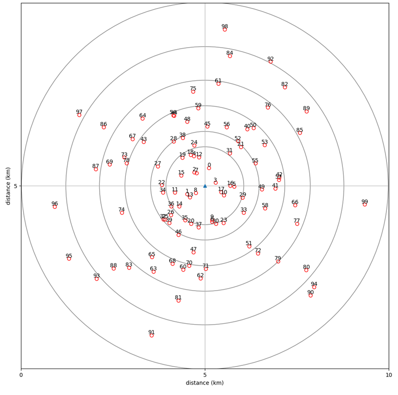
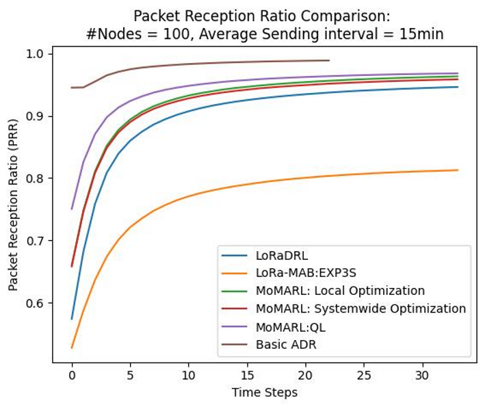
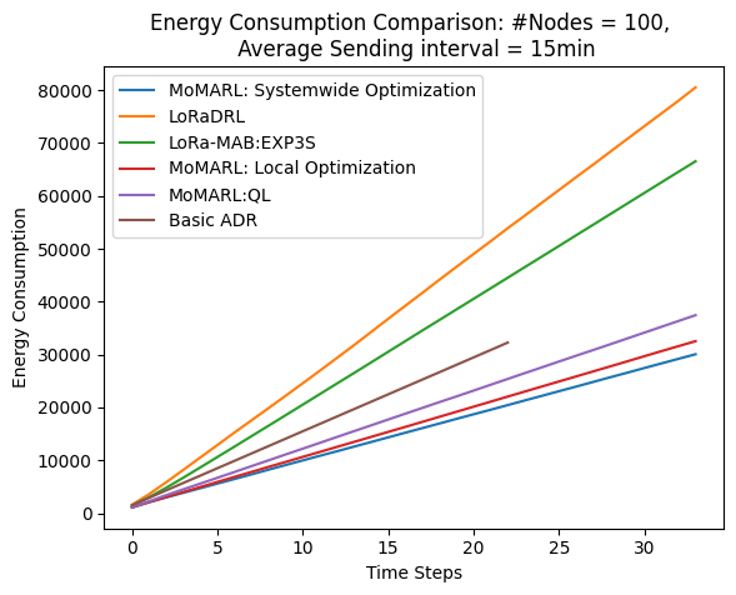
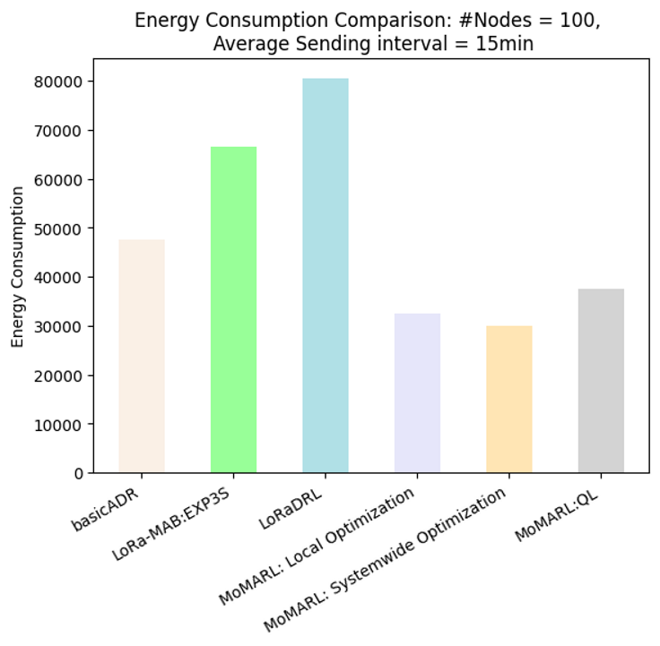

# LoRaWAN Dynamic Resource Allocation 

## Introduction
In this project, we are going to compare the Multi Armed Bandit, LoRaDRL and other DRL based resource optimization approaches. The simulation environment is build on IoT-MAB. 
IoT-MAB is a discrete-event simulator based on SimPy for simulating intelligent distributed resource allocation in LoRa networks and to analyse scalability. We also combine the classed and functions for Physical layer of LoRA. 

This project is based on the IoT-MAB project: https://github.com/tuyenta/IoT-MAB

## Installation
It is recommend to use virtualenv to keep your Python environment isolated, together with virtualenvwrapper to make working with virtual environments much more pleasant, e.g.:

```python
$ pip install virtualenvwrapper
...
$ export WORKON_HOME=~/.virtualenvs
$ mkdir -p $WORKON_HOME
$ source /usr/local/bin/virtualenvwrapper.sh
$ mkvirtualenv -p python3 dynamic_adr
```

You can install the required packages using the provided requirements.txt file:

```python
(dynamic_adr)$ pip install -r requirements.txt
```

## Usage

### Synopsis

```python
python3 dynamic_adr_script.py <nrNodes> <nrIntNodes> <nrBS> <initial> <radius> <distribution> <AvgSendTime> <horizonTime>
<packetLength> <freqSet> <sfSet> <powerSet> <captureEffect> <interSFInterference> <infoMode> <logdir> <exp_name>
```

Example:

```python
python3 dynamic_adr_script.py --nrNodes 5 --nrIntNodes 5 --nrBS 1 --initial UNIFORM --radius 2000 --distribution '0.1 0.1 0.3 0.4 0.05 0.05' --AvgSendTime 360000 --horizonTime 10  --packetLength 50 --freqSet '867300' --sfSet '7 8'  --powerSet "14"  --captureEffect 1  --interSFInterference 1 --infoMode NO --algo 'exp3s' --logdir logs --exp_name exp1
```
### Description
**nrNodes**

Total number of end devices (nodes) to simulate in the network.

**nrIntNodes**

Number of intelligent (smart) nodes using learning-based algorithms. Must be less than or equal to `nrNodes`.

**nrBS**

Number of LoRaWAN gateways (base stations) in the simulation.

**initial**

Initialization method for the learning algorithm's action probabilities. Use `UNIFORM` for equal probability distribution or `RANDOM` for random initialization.

**radius**

Radius (in meters) of the simulated network area. All nodes are placed within this circular region.

**distribution**

Proportion of nodes assigned to each region within the network. Values should sum to 1.0. For example, `0.5 0.3 0.2` means 50% of nodes in region 1, 30% in region 2, and 20% in region 3.

**AvgSendTime**

Average interval (in milliseconds) between consecutive transmissions from each node.

**horizonTime**

Number of simulation cycles (iterations). The total simulated time is `horizonTime × AvgSendTime`.

**packetLength**

Size of each data packet (in bytes) sent by nodes.

**sfSet**

Set of Spreading Factors (SF) to be considered, specified as space-separated values between 7 and 12 (e.g., `7 8 9`).

**freqSet**

Set of carrier frequencies (in kHz) available for transmission, specified as space-separated values (e.g., `867300 868100`).

**powerSet**

Set of transmission power levels (in dBm) available to nodes, specified as space-separated values (e.g., `14 17`).

**captureEffect**

Enable (1) or disable (0) the capture effect, which allows a stronger signal to be received in the presence of interference.

**interSFInterference**

Enable (1) or disable (0) inter-spreading factor interference, which models imperfect orthogonality between different SFs.

**infoMode**

Level of information output during simulation. Options may include `NO`, `PARTIAL`, or `FULL` (refer to code for supported values).

**algo**

Specifies the learning algorithm used by intelligent nodes for resource allocation. Supported values include `exp3s`, `exp3`, ``DDQN_ARA``, ``DDQN_LORADRL``, ``QL_ARA``, ``DQN_ARA``, ``DDQN_sysOptim``, ``masterAgent``and ``basicAdr``others as implemented in the code.

- DDQN_LORADRL: 
Implementation of https://ieeexplore.ieee.org/abstract/document/9314772

    Ilahi, Inaam, et al. "LoRaDRL: Deep reinforcement learning based adaptive PHY layer transmission parameters selection for LoRaWAN." 2020 IEEE 45th Conference on Local Computer Networks (LCN). IEEE, 2020.


- DQN_ARA: Modified multi-objective multi-agent Deep Q learning algorithm with reward function 

$$
Reward_{ARA} = \frac{\alpha \cdot PRR_{\text{node}} \cdot \text{int}(! pktLost)}
     {\beta \cdot airtime_{pkt}}
$$


- basicADR: Implementation of basic Adaptive Datarate Mechanism based on Semtech's recommendation

- DDQN_ARA: Double deep Q learning multi-agent Actor-Critic algorithm 

- QL_ARA: Q learning based multi-objective and multi-agent algorithm

- DDQN_sysOptim: A single agent ADR algorithm with systemwide optimization

$$
Reward_{MoMARL_{sysOptim}} = \frac{\alpha \cdot PRR_{\text{sys}} \cdot \text{int}(! pktLost)}
 {\beta \cdot AvgEnergyPerPkt}
$$

**logdir**

Directory name where simulation logs and output files will be stored.

**exp_name**

Name of the experiment/scenario, used to organize output files and results.

### Output

The result of every simulation run will be appended to a file named prob..._X.csv, ratio....csv, energy....csv and traffic....csv, whereby

* prob..._X is the probability of device X.

* ratio... is the packet reception ration of the network.

* energy... is the energy consumption of the network.

* traffic... is the normalized traffic and normalized throughput of the network.

The data file is then plotted into .png file by using matplotlib.


## Summary

- **Modular reinforcement-learning agents**: Added several modular RL agents in `lora/Agent.py` including `LoRaDRL`, `AdaptiveResourceAllocation`, `LoRaQLAgent`, `DQNAgent`, and `AraSysOptimizerAgent`. These classes provide DQN-style, Q-learning, and custom reward-structure implementations to support experimentation with RL-based resource allocation.
- **RL-enabled node classes**: Added new node classes in `lora/node.py` to support learning agents (for example, `RLNode`). These nodes handle state representation, interaction with agents, and action execution (SF/power/channel selection).
- **RL packet classes**: Added packet types in `lora/packet.py` (for example, `RLPacket`) that carry additional metadata required for learning, such as reward flags, episode IDs, and transmission features used for agent observations.
- **Where to look**: See `lora/Agent.py`, `lora/node.py`, and `lora/packet.py` for implementation details and examples of how agents interact with the simulator.


## Experiment and Intermediary Results

**Objectives**
- Maximize: $Packet Reception Ratio, PRR_{system}$
- Minimize: $Energy Consumption of system$

**Subject to**
- $SF \in \{7, 8, 9, 10, 11, 12\}$
- Transmission Power, $TP \in \{2, 4, 6, 8, 10, 12, 14\}$ dBm
- $Frequency \in \{868100, 868300, 868500\}  𝐾𝐻𝑧$
- Bandwidth = 125 KHz
- No retransmissions

**Node Distribution**
- Number of Nodes = 100
- Number of Gateways = 1
- Radius/range = 4.5 km
- Average Sending Interval = 15
- Packet Length = 50 bytes
- Captur Effect = True
- Inter SF Interference = True
- Preamble length = 8 bytes



**Results**

**Figure 1: Packet Reception Ratio (PRR) Comparison**


Comparison of packet reception ratios across different algorithms. Shows how well each resource allocation strategy achieves the primary objective of maximizing network PRR.

**Figure 2: Energy Consumption Analysis**


Energy consumption per packet across different algorithms. Demonstrates the trade-off between PRR optimization and power efficiency for each allocation strategy.

**Figure 3: Throughput and Fairness Metrics**


Normalized traffic and throughput performance across algorithms. Illustrates the overall network efficiency and how each algorithm balances load distribution among nodes.
